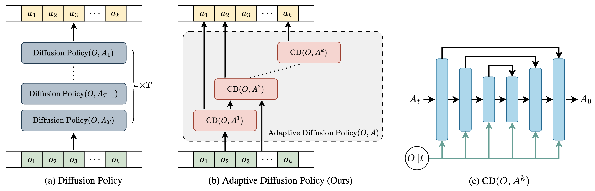

# Adaptive Diffusion Policy

_Submitted to International Conference on Computer Vision, ICCV 2025_

[Project Page](https://adaptive-diffusion-policy.github.io)



We propose Adaptive Diffusion Policy (ADP), a novel approach that enhances both efficiency and performance in robotic action generation. ADP significantly outperforms current state-of-the-art diffusion-based policies in both performance and inference speed. 


# Installation

## 1. Install dependencies

create a fresh python environemnt:

```bash
conda create -n adp python=3.9
```

activate the environment

```bash
conda activate adp
```

run the following command to install dependencies:

```bash
pip install -r requirements.in
```

## 2. Download data

Download the `push_t.zip` dataset

```bash
wget https://diffusion-policy.cs.columbia.edu/data/training/pusht.zip
```

Make the `data` directory and extract the zip file to `./data`

```bash
mkdir data && unzip push_t.zip -d data
```

# Training

You can train ADP by running the following command:

```bash
python train.py --config-dir=. --config-name=pusht_adaptive_diffusion_policy_cnn.yaml
```

# Evaluation

You can compute the mean score using

```bash
python eval.py --checkpoint <checkpoint-path> --output_dir <output_directory>
```

It will generate visualizations in `media` and `eval_log.json` will be created which contains the evaluation metrics.

# License

This repository is released under the MIT license. See [LICENSE](LICENSE) for more details.

# Acknowledgements

Thanks to [Diffusion Policy](https://github.com/real-stanford/diffusion_policy), [Consistency Policy](https://github.com/Aaditya-Prasad/Consistency-Policy), [Streaming Diffusion Policy](https://github.com/Streaming-Diffusion-Policy/streaming_diffusion_policy), and [VQ-BeT](https://github.com/jayLEE0301/vq_bet_official) for publicly releasing their code. 
